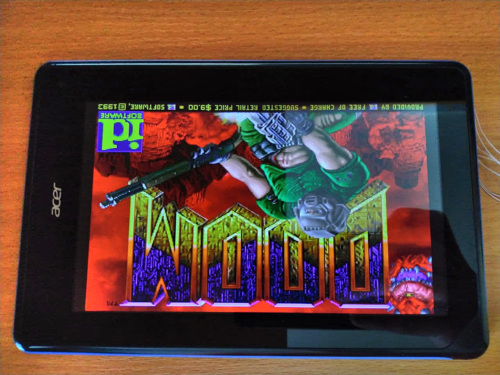
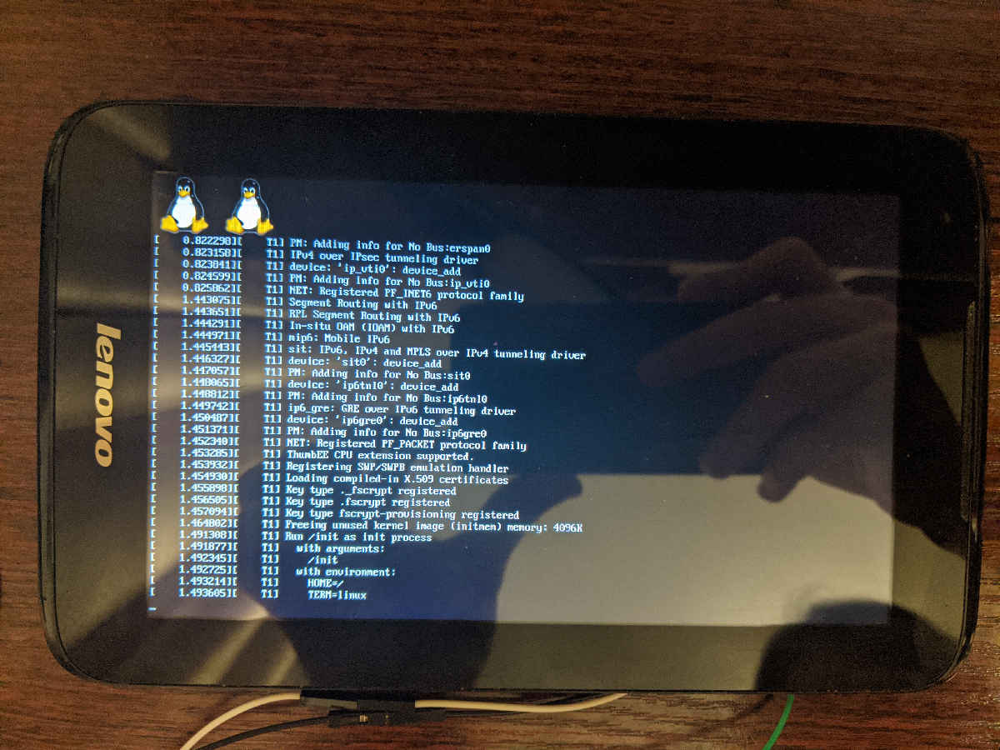
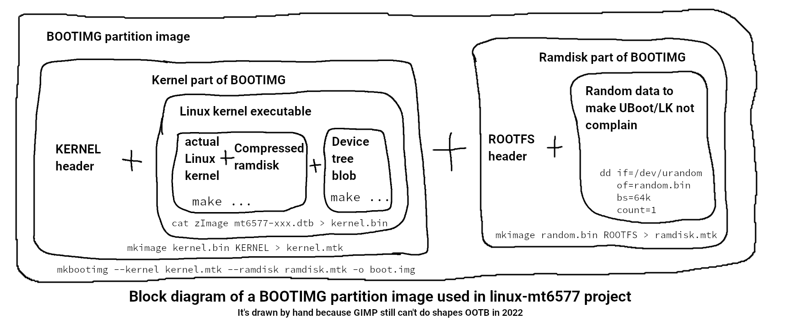

# 🛸 Attention 🛸 Danger zone 🛸
History is being overwritten here. **Force pushes and weird rebases happen often in this repository**. Be careful in case you will ever want to fork this.

# MT6577 Linux support
This repository contains my small work on mainlining the MT6577 Cortex-A9 CPU

|  |  |
| --- | --- |
| _Acer Iconia B1-A71 running [WOOD](https://github.com/maximevince/fbDOOM) on linux-mt6577 kernel_ | _Lenovo IdeaTab A1000L-F displaying linux-mt6577 boot log_ |

## Introduction

Back in 2011~2013, MediaTek MT6575/77 Cortex-A9 CPUs were very popular for low-end mobile phones. There are more than 100 devices utilizing these processors. Moreover, there are so-called tablet revisions (like MT8317) of MT6577 without cellular capabilities. Most of these devices run Android 4.0-4.2, and they have never received any real OS updates althrough there were reports of developers successfully porting Android 4.4. According to my research of public repositories of MediaTek kernels, vast majority of MT6575/77 devices uses Linux kernel v3.4.x. Bringing a mainline support for these processors will give devices a second life.

These chips were not performant even back in 2012, but they still can power a tiny webserver, a network file storage or some simple digital playground. I encourage everyone who has knowledge to help make it work. I started working on this without having any particular skills and knowledge, and what you see here is result of many months of work.

The code published in this repository has been tested and proved working (more on that below) on Linux v5.8~v5.18 running on Acer Iconia B1-A71 (MT8317). The device boots and communicates over UART. I also made screen work but it uses a framebuffer allocated by UBoot for showing a boot logo. The proper framebuffer+mtkfb binding still has to be made.

---

## What works

1. Multicore operating mode (SMP). Current code is able to perform full power cycle (power on, power off) for the 2nd CPU core.

2. Generic hardware such as SCU, bogus clocks, timer, sysirq, GIC.

3. 4 UARTs. On some MediaTek devices Bluetooth, and WiFi, and other radio communication hardware is controlled over UART. Working UART makes interacting with such hardware easier and provides a room for driver development.

4. Basic screen output with `simple-framebuffer` driver using framebuffer pre-configured by UBoot. However no image might show up under certain conditions, read more below.

## Important notes and TODOs

(when referring to "Current ...", I mean the latest kernel version at the time of writing this which is 5.18-rc6)

1. simple-framebuffer works when the device is turned on while on charger or connected to the PC. Screen might get stuck on vendor boot logo when booted without a charger/USB connection.

2. Need to process ATAGS passed from the bootloader to get *some* very useful values such as in-memory addresses of the kernel image and initramfs, and valid framebuffer address (it actually varies). This would completely eliminate the need to change addresses in a DTS or messing with a bogus ramdisk (more on this below), and it will solve the simple-framebuffer issue described above. On 5.16-rc2 *just* enabling the ATAGS support causes kernelpanic even before the earlyprintk is available. Most likely (but not yet confirmed) most ATAGS must be ignored in mainline kernel, probably in the `fixup` function?

3. Please help me port the **clock driver**. It'd be awesome as most device drivers depend on clocks.

4. No real I2C support for MT6577. Existing i2c-mt65xx driver was never supposed to support MT6577 because it relies on I2C DMA engine not present on this SoC. On Apr 16 19:20:48 PDT 2022, my commits (GH: [1](https://github.com/arzam16/linux-mt6577/commit/4b52288f33f4a09138f2edf786d23d27950104be) and [2](https://github.com/arzam16/linux-mt6577/commit/dace14f65a2da8e0afa66da26ead76356b355d24)) have been finally applied (LKML: [1](https://lists.infradead.org/pipermail/linux-mediatek/2022-April/039222.html) and [2](https://lists.infradead.org/pipermail/linux-mediatek/2022-April/039223.html)) by Wolfram Sang.

## Building

### Kernel config

Check the `additional-files/cfg` directory. `CONFIG_INITRAMFS_SOURCE` **must be changed** with path to your ramdisk .cpio.

### Initramfs

I went with a buildroot-2021.11 ramdisk that starts a shell on UART and supports file transfer out of the box (with `lrzsz` package). My buildroot config is in the `additional-files/cfg` directory.  `BR2_CCACHE_DIR` **must be changed** with path to your cache directory.

### Headers

Keep in mind how an old Mediatek bootloader (UBoot or LK) works in terms of booting a kernel. The very simplified algorithm is:
1. Read the BOOTIMG partition from the EMMC.
2. Read the 1st part of BOOTIMG containing the kernel executable.
3. Verify if the 1st part has a valid `KERNEL` header. Abort if there's no header.
4. Read the 2nd part of BOOTIMG containing the ramdisk.
5. Verify if the 2nd part has a valid `ROOTFS` header. Abort if there's no header.
6. Load kernel executable without KERNEL header into specific memory address.
7. Load ramdisk without ROOTFS header into specific memory address.
8. Prepare ATAGS and jump into the kernel memory address.

UBoot/LK require a special mediatek header added to both kernel and initramfs. Add them every time you're making a boot.img. There's an utility for this called `mkimage`.

Such an old bootloader does not support DTS out of the box, so a DTS has to be appended to the kernel image (the corresponding kernel config option must be enabled).

Every time you make a change in initramfs (.cpio) image, you have to recalculate it's size for `linux,initrd-end` parameter in the device-specific DTS. It's very annoying, to say the least. To combat that I just pack the initramfs into the kernel executable itself. But with this trick the bootloader will refuse to boot because it won't find the initramfs in BOOTIMG. I made an ugly (but working) workaround: even when you have an initramfs already embedded into the kernel image, just add a tiny decoy (dummy) initramfs to boot.img, but don't forget to add a header.
```
# Generate 64 kB of random crap
dd if=/dev/urandom of=ramdisk-dummy bs=64k count=1

# Append a MediaTek header so UBoot will pass a check
mkimage ramdisk-dummy ROOTFS > ramdisk-dummy.mtk 

# Then use it for creating a flashable boot.img:
mkbootimg --kernel ... --ramdisk ramdisk-dummy.mtk -o boot.img
```



## Notes on MT6575

Since MT6577 is a dual-core version of MT6575, just remove the second CPU core definition from DTS and you're good to go. MT6575 also lacks 3rd I2C bus, but as of now it's not declared for MT6577 either.

It might be a great idea to use MT6575 as a base DTS, and create a small DTS for MT6577 with all necessary changes like second CPU core and third I2C bus.

## Post scriptum

I would like to thank everyone in [postmarketOS community](https://wiki.postmarketos.org/wiki/Category:Community) who helped me and expressed all kinds of support.
